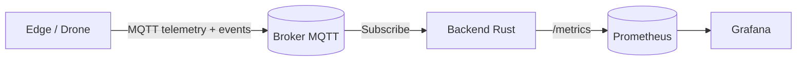

# Arquitectura general

## Visión global
El sistema sigue un flujo event-driven: el edge publica telemetría y eventos, el backend consume y expone métricas, y Prometheus/Grafana observan el estado. Se prioriza desacoplamiento, trazabilidad operativa y escalabilidad horizontal.

## Principios de diseño
- Desacoplamiento productor/consumidor mediante MQTT.
- Observabilidad nativa con Prometheus, sin capas intermedias innecesarias.
- Separación de responsabilidades: ingesta, métricas, visualización.
- Evolución incremental sin romper el core.

## Diagrama de arquitectura

## Flujo de datos extremo a extremo
1. Edge publica telemetría de alta frecuencia y eventos discretos en topics separados.
2. MQTT actúa como bus de eventos y desacopla el ritmo del productor y consumidor.
3. Backend consume, extrae campos relevantes y expone métricas Prometheus.
4. Prometheus scrappea métricas y Grafana visualiza/alerta.

## Estado actual vs evolución
- Estado actual: un edge simulado, un backend, un broker MQTT, Prometheus y Grafana.
- Evolución futura (no implementada): múltiples drones, shared subscriptions, simulación MAVLink/PX4.
