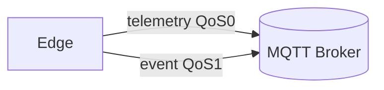

# Capa Edge

## Responsabilidad del edge
- Generar y publicar telemetría de operación y eventos críticos.
- Mantenerse lo más simple y resiliente posible ante desconexiones.
- No asumir disponibilidad de backend ni de APIs HTTP.

## Por qué no se envían datos por HTTP directo
- HTTP acopla productor y consumidor (endpoint fijo, semántica request/response).
- El edge suele operar con conectividad intermitente; MQTT tolera reconexión y buffering del broker.
- MQTT permite múltiples consumidores sin reconfigurar el edge.

## Telemetría vs eventos
- Telemetría: alta frecuencia, tolera pérdida puntual.
- Eventos: baja frecuencia, deben conservarse para alertas y post-mortem.
- Esta separación evita mezclar semánticas y facilita QoS adecuados.

## Decisiones de QoS
- Telemetría con QoS 0: reduce overhead y evita saturar el broker.
- Eventos con QoS 1: garantiza entrega al menos una vez, aceptando duplicados.

## Riesgos y mitigaciones
- Riesgo: pérdida de eventos críticos.
  - Mitigación: QoS 1 y topics separados.
- Riesgo: sobrecarga del broker por telemetría alta.
  - Mitigación: QoS 0 y control de tasa en el edge.
- Riesgo: reconexiones silenciosas.
  - Mitigación futura: callbacks y métricas de conexión (no implementado).

## Diagrama de flujo edge → MQTT

## Evolución futura (no implementada)
- Integración MAVLink/PX4 con mapeo explícito de mensajes a eventos.
- Buffering local si el broker no está disponible.
