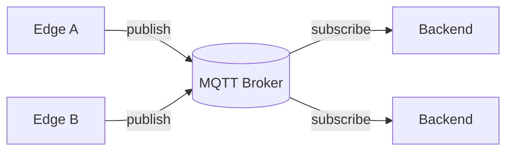

# Capa MQTT

## MQTT como bus de eventos
MQTT proporciona desacoplamiento temporal y funcional entre productores y consumidores. El broker actúa como punto central de distribución sin imponer semánticas de negocio.

## Topics y semántica
- `drone/<id>/telemetry`: telemetría continua.
- `drone/<id>/event`: eventos discretos relevantes para alertas.
- La separación por tipo evita ambigüedad y simplifica reglas de observabilidad.

## QoS y retención
- QoS 0 para telemetría: minimiza overhead y evita congestión.
- QoS 1 para eventos: entrega al menos una vez; el backend debe tolerar duplicados.
- Retain no se usa en el estado actual para evitar confundir estado con eventos.

## Errores comunes
- Usar QoS alto para todo y saturar el broker.
- Mezclar telemetría y eventos en el mismo topic.
- Reutilizar `client_id` en múltiples instancias.

## Consideraciones de escalabilidad
- Shared subscriptions permiten balancear carga entre múltiples backends.
- Segmentación por `drone/<id>` facilita aislamiento y permisos.
- Limitar tasas de publicación evita que un drone degrade el sistema completo.

## Diagrama pub/sub

## Estado actual vs evolución
- Estado actual: un broker, un backend, un edge.
- Evolución futura: múltiples backends con shared subscriptions y ACLs por drone.
