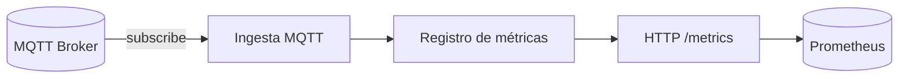

# Backend Rust

## Rol del backend como SOC
El backend actúa como punto central de observabilidad: consume eventos, extrae señales relevantes y expone métricas para análisis y alertas. No es un motor de control ni de almacenamiento histórico.

## Consumo de eventos
- Suscripción separada para telemetría y eventos.
- Parseo parcial del payload para evitar acoplamiento rígido al esquema.
- Tolerancia a cambios de formato mientras se mantenga el campo crítico.

## Métricas y healthchecks
- `/metrics` expone métricas Prometheus.
- `/healthz` confirma que el proceso está vivo, no que el broker esté sano.
- Separación HTTP/MQTT simplifica diagnósticos.

## Decisiones en Rust
- Async para manejar MQTT y HTTP sin bloquear.
- Estado compartido mínimo y explícito.
- Registro de métricas manual para control preciso.

## Escalabilidad horizontal
- Requiere `client_id` único por instancia.
- Para balanceo real se recomiendan shared subscriptions.
- Eventos con QoS 1 deben ser idempotentes o deduplicables.

## Diagrama interno del backend

## Estado actual vs evolución
- Estado actual: métricas básicas y una sola fuente de telemetría.
- Evolución futura: métricas de errores MQTT, backoff y deduplicación de eventos.
