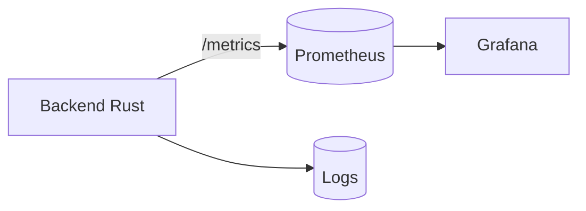

# Observabilidad

## Métricas vs logs vs eventos
- Métricas: series temporales para tendencias y alertas.
- Logs: detalle operativo; útiles para debugging puntual.
- Eventos: señales discretas con semántica de negocio.

## Por qué Prometheus
- Modelo pull simple, robusto en redes internas.
- Integración directa con Grafana.
- Evita gateways o exporters adicionales en un sistema base.

## Qué mide el sistema y qué no
- Mide: conteo de mensajes MQTT y última batería observada.
- No mide: latencia end-to-end, disponibilidad del broker, ni pérdidas.
- Esta limitación es explícita para evitar falsa confianza.

## Integración con Grafana
- Grafana consume series de Prometheus.
- Dashboards enfocan salud y tendencias básicas.

## Buenas prácticas de alertado
- Alertas por ausencia de telemetría (silencio anómalo).
- Alertas por eventos críticos (ej. batería baja).
- Evitar alertas basadas solo en métricas de proceso.

## Diagrama de observabilidad

## Estado actual vs evolución
- Estado actual: métricas base y dashboards simples.
- Evolución futura: métricas de errores MQTT y SLOs por drone.
