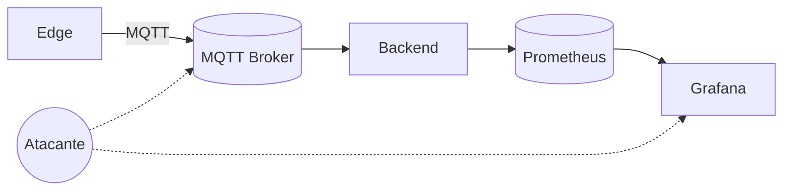

# Seguridad

## Modelo de amenazas (alto nivel)
- Edge comprometido publica datos falsos o maliciosos.
- Intercepción o manipulación de tráfico MQTT.
- Backend expuesto a payloads malformados.
- Acceso no autorizado a métricas y dashboards.

## Riesgos principales
- MQTT sin autenticación ni cifrado.
- Inyección de eventos falsos que disparen alertas.
- Exposición de métricas internas en redes no confiables.

## Seguridad actual (estado real)
- Seguridad mínima, adecuada solo para laboratorio.
- No se asume TLS ni ACLs MQTT.
- No hay control de acceso en `/metrics`.

## Medidas recomendadas
Corto plazo (sin cambiar arquitectura):
- Autenticación en broker MQTT y ACL por topic.
- TLS en MQTT y en Grafana si está expuesto.
- Separación de red interna para servicios de observabilidad.

Largo plazo (evolución):
- Firmas de mensajes en el edge.
- Validación estricta de esquemas en backend.
- Identidad por drone y rotación de credenciales.

## Qué NO hacer (antipatrones)
- Exponer MQTT públicamente sin ACL.
- Reutilizar credenciales entre drones.
- Basar decisiones críticas solo en telemetría sin validación.

## Diagrama de superficie de ataque

## Estado actual vs evolución
- Estado actual: controles mínimos.
- Evolución futura: autenticación fuerte y validación de payloads.
