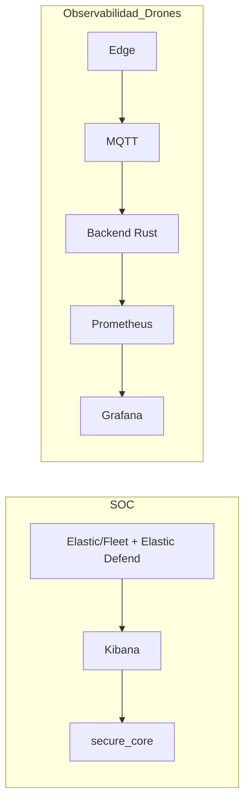

# 00-FLEET-DOCKER-ELK-INTEGRATION.md

## 1. Contexto y problema
Este repo (docker-drones) entrega observabilidad tecnica del flujo Edge -> MQTT -> Backend -> Prometheus -> Grafana. En paralelo, el SOCaaS secure_core ya ingesta alertas y datos de seguridad desde Elastic (docker-elk con Fleet/Elastic Defend). Sin una documentacion clara, es facil confundir "Fleet (Elastic)" con "fleet (flota de drones)" y mezclar dominios con requisitos distintos.

El objetivo de este documento es delimitar responsabilidades entre stacks, definir el punto de integracion y mantener contratos estables. Se prioriza trazabilidad y compatibilidad futura sin introducir deuda tecnica ni cambios de comportamiento en los sistemas existentes.

Terminos clave:
- "Fleet (Elastic)": control plane de Elastic para gestionar Elastic Agents.
- "fleet (flota)": conjunto de drones operativos y su telemetria.

## 2. Mapa de repos/stacks
| stack | objetivo | datos principales | owner |
|---|---|---|---|
| docker-drones | observabilidad tecnica de drones | telemetria/eventos -> metricas Prometheus | equipo drones |
| docker-elk (Fleet/Elastic Defend) | ingesta SIEM/EDR | logs, alerts, detections | equipo SOC |
| secure_core (Rust) | SOCaaS core | alertas SIEM, correlacion | equipo SOCaaS |

## 3. Limites y responsabilidades
- docker-drones: genera telemetria/eventos MQTT, expone metricas y dashboards tecnicos.
- docker-elk: gestiona Fleet Server, Elastic Agents, indexa logs/alerts en Elastic.
- secure_core: consume datos de seguridad desde Elastic/Kibana y aplica logica SOC.
- Integracion: no se mezclan metricas tecnicas de drones con alertas SIEM sin contrato.

## 4. Contratos de integracion (datos y flujo)
### 4.1 Elastic/Fleet -> secure_core (SOC)
- Fuente: Elastic Security (docker-elk) con Fleet/Elastic Defend.
- Datos: alerts/detections, eventos de seguridad, estado de agentes.
- Mecanismo: APIs oficiales de Elastic/Kibana (lectura por secure_core).
- Contrato: esquema de alertas y campos estandar de Elastic Security.

### 4.2 Drones -> Prometheus/Grafana (observabilidad tecnica)
- Fuente: Edge -> MQTT -> Backend (Rust) en docker-drones.
- Datos: metricas definidas en `METRICS.md`.
- Mecanismo: scrape Prometheus a `backend:8080/metrics`, dashboards en Grafana.

### 4.3 Drones -> Elastic (FUTURO, opcional)
- Motivo: correlacionar telemetria con incidentes SOC.
- Riesgos: alta cardinalidad (ej. lat/long), ruido SIEM, costo de indexacion.
- Condicion: requeriria contrato propio y filtros estrictos para evitar deuda.

## 5. Requisitos minimos para Fleet/Elastic Agent (conceptual)
Variables tipicas segun documentacion oficial de Elastic para contenedores:
- `FLEET_SERVER_ENABLE=1` (habilita modo Fleet Server).
- `FLEET_SERVER_ELASTICSEARCH_HOST=https://elasticsearch:9200` (endpoint de ES).
- `FLEET_SERVER_SERVICE_TOKEN=...` (token de servicio, no exponer).
- `FLEET_SERVER_POLICY_ID=...` (policy ID para Fleet Server).
- `FLEET_ENROLL=1` (enroll del Elastic Agent).
- `FLEET_URL=https://fleet-server:8220` (URL de Fleet Server).
- `FLEET_ENROLLMENT_TOKEN=...` (token de enrollment, no exponer).

Nota importante:
- Agentes Windows no corren como contenedor; se instalan como servicio en host Windows.
- Su rol es reportar telemetria de seguridad al mismo Fleet Server.

## 6. Riesgos tipicos y anti-patrones
- Confundir Fleet (Elastic) con fleet (flota) y mezclar dominios.
- Alta cardinalidad: no usar lat/long como labels en Prometheus.
- Mezclar SIEM con observabilidad tecnica sin frontera contractual.
- Exportar eventos de drones a Elastic sin filtros de volumen ni esquema estable.

## 7. Como automatizar dashboards sin UI
### A) Provisioning (GitOps)
Estructura tipica:
```
observability/
  grafana/
    provisioning/
      dashboards/
        dashboards.yml
      datasources/
        datasources.yml
    dashboards/
      drones-overview.json
```

Ejemplo de provider YAML (Grafana):
```yaml
apiVersion: 1
providers:
  - name: "drones"
    orgId: 1
    folder: "Drones"
    type: file
    disableDeletion: true
    updateIntervalSeconds: 30
    options:
      path: /var/lib/grafana/dashboards
```

Montaje en docker-compose (este repo):
- `./observability/grafana/provisioning:/etc/grafana/provisioning:ro`
- `./observability/grafana/dashboards:/var/lib/grafana/dashboards:ro`

### B) API por comandos (Grafana HTTP API)
Crear folder:
```bash
curl -X POST http://localhost:3000/api/folders \
  -H "Authorization: Bearer <GRAFANA_API_TOKEN>" \
  -H "Content-Type: application/json" \
  -d '{"title":"Drones"}'
```

Importar dashboard:
```bash
curl -X POST http://localhost:3000/api/dashboards/db \
  -H "Authorization: Bearer <GRAFANA_API_TOKEN>" \
  -H "Content-Type: application/json" \
  -d @./observability/grafana/dashboards/drones-overview.json
```

## 8. Checklist operacional (sin UI)
- Prometheus targets UP (endpoint `/targets`).
- Metricas visibles en `http://localhost:9090`.
- Dashboard cargado por provisioning o API (sin usar UI).

## 9. Roadmap (prioridades)
- P0: documentar contrato de datos secure_core <-> Elastic (campos minimos).
- P0: definir naming estable de dashboards y carpetas Grafana.
- P1: validar limites de cardinalidad para cualquier export a Elastic (FUTURO).
- P1: establecer runbook de fallos comunes entre stacks.
- P2: trazabilidad end-to-end con IDs correlacionables (FUTURO).
- P2: agregar pruebas de smoke para dashboards por API.

## Diagramas
### Dominios (SOC vs observabilidad drones)


### Flujo de datos (drones)


### Integracion SOC (Elastic/Fleet -> secure_core)

